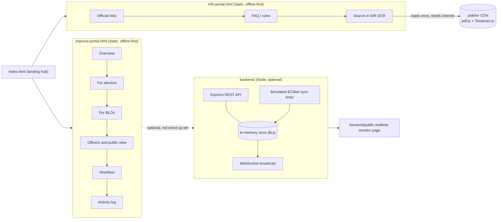

# Architecture overview

This prototype has four independent pieces. None of them require the others
to run.

## 1. `index.html` — landing hub
A thin static page with two cards linking to the two portals below, plus
links to the docs and the backend. No tabs, no demo data, nothing to break.

## 2. `info-portal.html` — the official-tools wrapper
A static file, demo-data-free (it only links out or runs OCR locally), using
the shared `assets/styles.css`. Tabs:

| Tab | Purpose |
| --- | --- |
| Official links | cards linking straight to ECI's own tools |
| FAQ / rules | full rulebook with citations, live search + quick filters |
| Search in SIR (OCR) | client-side OCR search over an uploaded scanned roll |

The OCR tab loads `pdfjs-dist@3.11.174` and `tesseract.js@5.0.4` from
jsDelivr the first time it runs; see the note below if upgrading those
versions — only pre-4.x pdfjs-dist releases publish the plain
`build/pdf.min.js` global script this page relies on; 4.x+ builds are
ES-module-only (`pdf.min.mjs`), which is why that version is pinned
deliberately rather than left to "latest".

## 3. `improve-portal.html` — the deficiency/fix demo
A static file with its own in-memory JS arrays (`E` for electors, `D` for
deletions). Reloading the page resets everything. Tabs:

| Tab | Purpose |
| --- | --- |
| Overview | plain-language status guide + a deficiency &rarr; fix table |
| For electors | status tracker + notice decoder |
| For BLOs | doorstep live check + "work so far" stats |
| Officers and public view | two-person deletion check + public dashboard |
| Workflow | automated-pipeline diagram, automated vs. needs-a-person |
| Activity log | append-only action log |

## 4. `backend/` — optional realtime-integration simulator
A small Express + `ws` server (`server.js`) backed by an in-memory store
(`db.js`) that stands in for a real election database connector. A timer
(`startSimulatedEciNetSync`) randomly advances a demo elector's stage and
emits an event, so the WebSocket feed has something to push — this is meant
to demonstrate what wiring in a real ECINet-style feed would look like, not
to be one. See `backend/DEMO.md` for a script to demo it to stakeholders.

It is **not wired into `improve-portal.html`** by default: the static page
keeps its own local demo data so it still runs with zero install/network. See
`backend/README.md` → "Wiring it to the static prototype" for how to connect
them.

## 5. `.github/workflows/deploy-pages.yml` — hosting automation
Deploys the repository root to GitHub Pages via `actions/*-pages` on every
push to `main`. This covers the hub and both static portals; the `backend/`
folder is a separate Node app and needs separate hosting if you want its
realtime monitor running publicly (see root `README.md` → "Host it later").

## Where the rules and designs came from
See [`docs/sources.md`](./sources.md) for the official documents and press
used for the SIR rules, and the live `voters.eci.gov.in` pages used as the
reference design for the OCR search tab's fields.
