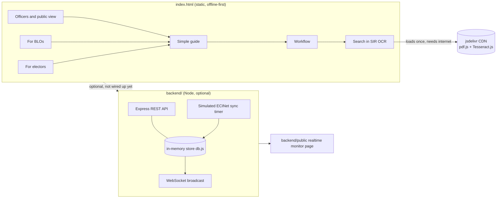

# Architecture overview

This prototype has three independent pieces. None of them require the others
to run.

## 1. `index.html` — the main prototype
A single static file, self-contained styling and script, demo data held in
in-memory JS arrays (`E` for electors, `D` for deletions). Reloading the page
resets everything. Tabs:

| Tab | Purpose |
| --- | --- |
| For electors | status tracker + notice decoder |
| For BLOs | doorstep live check + "work so far" stats |
| Activity log | append-only action log |
| All rules | full rulebook with citations |
| Officers and public view | two-person deletion check + public dashboard |
| Simple guide | plain-language status overview, built vs. planned |
| Workflow | automated-pipeline diagram, automated vs. needs-a-person |
| Search in SIR (OCR) | client-side OCR search over an uploaded scanned roll |

Everything except the OCR tab works with no network connection. The OCR tab
loads `pdfjs-dist@3.11.174` and `tesseract.js@5.0.4` from jsDelivr the first
time it runs; see the note in `index.html`'s `<script>` tags if upgrading
those versions — only pre-6.x pdfjs-dist releases publish the plain
`build/pdf.min.js` global script this page relies on; 4.x+ builds are
ES-module-only (`pdf.min.mjs`), which is why that version is pinned
deliberately rather than left to "latest".

## 2. `backend/` — optional realtime-integration simulator
A small Express + `ws` server (`server.js`) backed by an in-memory store
(`db.js`) that stands in for a real election database connector. A timer
(`startSimulatedEciNetSync`) randomly advances a demo elector's stage and
emits an event, so the WebSocket feed has something to push — this is meant
to demonstrate what wiring in a real ECINet-style feed would look like, not
to be one.

It is **not wired into `index.html`** by default: the static page keeps its
own local demo data so it still runs with zero install/network. See
`backend/README.md` → "Wiring it to the static prototype" for how to connect
them.

## 3. `.github/workflows/deploy-pages.yml` — hosting automation
Deploys the repository root to GitHub Pages via `actions/*-pages` on every
push to `main`. This only covers the static `index.html` side; the `backend/`
folder is a separate Node app and needs separate hosting if you want its
realtime monitor running publicly (see root `README.md` → "Host it later").

## Where the rules and designs came from
See [`docs/sources.md`](./sources.md) for the official documents and press
used for the SIR rules, and the live `voters.eci.gov.in` pages used as the
reference design for the OCR search tab's fields.
